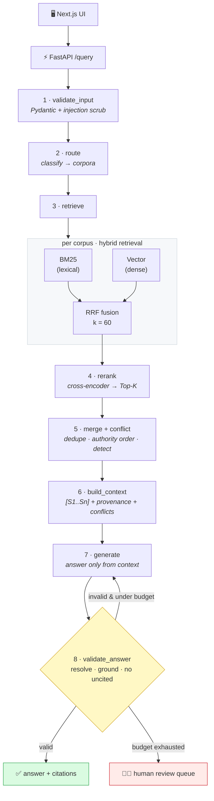

<div align="center">

# ⚖️ Legal RAG

### Grounded answers to US legal questions — every sentence backed by a verifiable citation.

A retrieval-augmented pipeline over **Federal statutes**, the **CFR**, and **case law** that
detects when sources disagree, cites page-and-paragraph provenance, and **refuses to answer
when it cannot ground the claim** — regenerating under a stricter prompt or escalating to a
human-review queue.

<br/>


</div>

---

> [!NOTE]
> **Runs fully offline with zero downloads.** With no API key or model present, the system
> degrades to a deterministic **mock LLM** and **mock embedder**, so the demo, the test suite,
> and the eval gate all produce real, reproducible output on a bare Python 3.11 — no GPU, no
> network, no model weights. Real models swap in behind one env flag.

<br/>

## 📑 Table of contents

- [Why this exists](#-why-this-exists)
- [What it does well](#-what-it-does-well)
- [Architecture](#️-architecture)
- [The pipeline, node by node](#-the-pipeline-node-by-node)
- [Quickstart — offline in 3 commands](#-quickstart--offline-in-3-commands)
- [See it work](#-see-it-work)
- [Documents & data sources used](#-documents--data-sources-used)
- [Models, libraries & the mock → production swap](#-models-libraries--the-mock--production-swap)
- [Configuration](#️-configuration)
- [API](#-api)
- [Testing & evaluation](#-testing--evaluation)
- [Project layout](#-project-layout)
- [Mapping to a legal-AI platform](#-mapping-to-a-legal-ai-platform)

<br/>

## 🎯 Why this exists

The single biggest failure mode of legal RAG is a **fluent, confident answer that the sources
don't actually support**. In law that's not a cosmetic bug — a hallucinated citation or a
missed *overruled* flag is malpractice-shaped.

This project treats **grounding as a gate, not a hope**. An answer is only returned if:

1. every `[S#]` citation **resolves** to a passage that was actually retrieved,
2. every cited sentence is **supported** by its passage, and
3. **no factual sentence is left uncited**.

If any check fails, the pipeline regenerates with a stricter prompt; if it still fails, it
returns `valid=false` and routes the query to a **human-review queue**. It would rather abstain
than guess.

<br/>

## ✨ What it does well

| | Feature | Why it matters |
|---|---|---|
| 🔀 | **Query routing** | Classifies each question to the right corpora (statute / regulation / case law) instead of searching everything and diluting results. |
| 🔎 | **Hybrid retrieval** | BM25 (exact tokens like `42 U.S.C. 1983`, `180 days`) **+** dense vectors (paraphrase & intent), fused with **Reciprocal Rank Fusion**. |
| 🎯 | **Cross-encoder rerank** | A precision pass that re-scores `(query, passage)` pairs jointly and keeps only the top-K. |
| ⚔️ | **Conflict detection** | Surfaces disagreement instead of averaging it: differing **deadlines** (180-day statute vs 300-day CFR), **mandatory vs permissive** language, and **overruled / superseded** markers. |
| 📌 | **Provenance** | Every chunk carries `source_id`, `title`, `page`, `paragraph` — the hook for bounding-box citation later. |
| ✅ | **Citation validation** | Resolution + grounding + no-uncited-claim checks, with a stricter-prompt regenerate loop. |
| 🧑‍⚖️ | **Human escalation** | Ungroundable answers are flagged, never emitted as fact. |
| 🧪 | **Eval as a CI gate** | A golden set scores retrieval recall, citation accuracy and grounded rate, and **fails CI below threshold**. |
| 🔌 | **Provider-agnostic** | Anthropic (default) / OpenAI / deterministic mock behind one interface. |
| 🧱 | **State machine** | A real LangGraph graph **and** a framework-free runner over the identical nodes. |

<br/>

## 🏛️ Architecture



The pipeline is a **state machine**: each box is a pure function `GraphState → partial update`.
The exact same node functions are driven either by a real `langgraph.StateGraph` (with a
conditional regenerate edge) **or** by a dependency-free `SequentialRunner` — which is the proof
that the design is a genuine state machine, not framework glue. Full walkthrough in
[`ARCHITECTURE.md`](./ARCHITECTURE.md).

<br/>

## 🧩 The pipeline, node by node

| # | Node | Responsibility | Key design choice |
|:-:|------|----------------|-------------------|
| 1 | `validate_input` | Pydantic contract + normalize + **neutralize prompt injection** | Strip the injected directive, keep the real question — don't over-block. |
| 2 | `route` | Classify query → `{federal, cfr, caselaw}` | Recall-oriented: pick multiple corpora when signals are weak. |
| 3 | `retrieve` | BM25 ∥ Vector per corpus → **RRF fuse** | RRF fuses on **rank**, not raw score — scale-free, no weight tuning. |
| 4 | `rerank` | Cross-encoder → Top-K | Precision the bi-encoders can't give, cheap over a small candidate set. |
| 5 | `merge_conflict` | Dedupe, order **statute > reg > case**, **detect conflicts** | Surface disagreement so the model must confront it. |
| 6 | `build_context` | Numbered `[S1..Sn]` + page/¶ provenance + injected conflicts | Stable, resolvable handles make grounding auditable. |
| 7 | `generate` | Answer **only** from context; cite every sentence; abstain if unsupported | Stricter prompt on regenerate makes the loop corrective. |
| 8 | `validate_answer` | **(a)** markers resolve **(b)** sentences grounded **(c)** none uncited | Fail → regenerate; exhaust budget → human review. |

<br/>

## 🚀 Quickstart — offline in 3 commands

No API keys. No model downloads. No external services.

```bash
# 1 · install (core deps only; mocks stand in for all models)
python -m venv .venv && . .venv/bin/activate && pip install -r requirements.txt

# 2 · run the whole pipeline end-to-end and print every stage
python backend/demo.py

# 3 · run the test suite and the eval promotion gate
cd backend && python -m pytest -q && cd .. && python eval/run_eval.py
```

Serve the API:

```bash
cd backend && uvicorn app.main:app --reload        # http://localhost:8000
curl localhost:8000/health
curl -X POST localhost:8000/query -H 'Content-Type: application/json' \
  -d '{"query":"What is the deadline to file an EEOC charge?"}'
```

Or with Docker: `docker compose up api` &nbsp;(add `--profile qdrant` for the vector DB).

<br/>

## 🔬 See it work

Ask a question with a **genuine statute-vs-regulation conflict** baked into the seed data:

> **Q:** *What is the deadline to file an EEOC charge for employment discrimination?*

```text
routed_to        : ['federal', 'cfr']
candidate_count  : 6          top_k_count : 6
valid            : True       regenerated : 0

conflicts:
  ⚔️ [deadline] Sources state different filing deadlines:
     [S1] = 180 days, [S4] = 300 days. The applicable window depends on
     jurisdiction/agency and which source controls.

answer:
  A charge ... shall be filed with the EEOC within 180 days ...            [S1]
  In a State ... with a fair employment practices agency, a charge ...
     shall be filed ... within 300 days ...                               [S4]
  The provided sources conflict and the more authoritative one governs [S1] [S4].

citations:
  [S1] ✓ verified — 42 U.S.C. § 2000e-5(e)(1)  (p.12, ¶e(1))
  [S4] ✓ verified — 29 C.F.R. § 1601.13         (p.1,  ¶a(4))
```

A different query (*"can a city be sued under §1983?"*) makes the **overruled** detector fire —
**Monroe v. Pape** is flagged as overruled by **Monell**, with a "treat this holding with
caution" note in the answer.

<br/>

## 📚 Documents & data sources used

### Seed corpus (public-domain US legal texts, in [`data/`](./data))

US government works — statutes, regulations, and judicial opinions — are **not subject to
federal copyright**. The seed set is small and hand-curated to exercise every feature (note the
deliberate 180-vs-300-day conflict and the overruled case).

| Corpus | Documents included | Why it's here |
|--------|--------------------|---------------|
| 🏛️ **Federal statutes** (`data/federal`) | **42 U.S.C. § 1983** (civil action for deprivation of rights) · **42 U.S.C. § 2000e-5(e)(1)** (Title VII charge filing — **180 days**) · **42 U.S.C. § 2000e-2(a)** (unlawful employment practices) | Core civil-rights & employment-discrimination statutes. |
| 📜 **CFR** (`data/cfr`) | **29 C.F.R. § 1601.13** (deferral-state filing — **300 days**) · **29 C.F.R. § 1601.74** (designated FEP agencies) · **28 C.F.R. § 35.104** (ADA Title II definitions) | Implementing regulations; the 300-day rule creates a real conflict with the 180-day statute. |
| ⚖️ **Case law** (`data/caselaw`) | **Monell v. Dep't of Social Services**, 436 U.S. 658 (1978) · **Owen v. City of Independence**, 445 U.S. 622 (1980) · **Monroe v. Pape**, 365 U.S. 167 (1961) *(overruled)* | Municipal liability & immunity; Monroe is flagged as overruled by Monell. |

### Real bulk corpora (documented, not scraped)

[`backend/app/ingest/fetch_public_data.py`](./backend/app/ingest/fetch_public_data.py) documents
exactly how to ingest the real corpora at scale — with official URLs — without scraping anything
at build time:

| Source | Official bulk endpoint |
|--------|------------------------|
| **U.S. Code** (Office of the Law Revision Counsel, USLM XML) | <https://uscode.house.gov/download/download.shtml> |
| **CFR** (GovInfo bulk data, GPO) | <https://www.govinfo.gov/bulkdata/CFR> · API <https://api.govinfo.gov/> |
| **Case law — Caselaw Access Project** (Harvard LIL) | <https://case.law/> |
| **Case law — CourtListener** (Free Law Project) | <https://www.courtlistener.com/help/api/rest/> |

> ⚠️ **This is an engineering demo, not legal advice.** Statutory text is paraphrased/abridged
> for the seed set; verify against the official sources above before relying on any citation.

<br/>

## 🧠 Models, libraries & the mock → production swap

Everything runs offline via a deterministic mock and swaps to the real component behind **one
flag or dependency — the interface never changes**.

| Concern | Offline default (this repo) | Production swap | How to switch |
|---------|-----------------------------|-----------------|---------------|
| **Embeddings** | `MockEmbedder` — pure-python hashing, 256-d | `sentence-transformers` **all-MiniLM-L6-v2** | `pip install sentence-transformers` · `USE_REAL_EMBEDDINGS=1` |
| **Reranker** | `MockCrossEncoder` — token overlap | **cross-encoder/ms-marco-MiniLM-L-6-v2** | `pip install sentence-transformers` · `USE_REAL_RERANKER=1` |
| **LLM** | `MockLLM` — deterministic, context-grounded | **Anthropic `claude-3-5-sonnet`** (default) / OpenAI | `pip install anthropic` · `USE_REAL_LLM=1` · `ANTHROPIC_API_KEY` |
| **Vector store** | `NumpyVectorIndex` — in-memory | **Qdrant** | `pip install qdrant-client` · `VECTOR_BACKEND=qdrant` · `docker compose --profile qdrant up` |
| **BM25** | pure-python Okapi BM25 | **`rank-bm25`** | already in `requirements.txt` |
| **Graph engine** | `SequentialRunner` — framework-free | **`langgraph.StateGraph`** | already in `requirements.txt` |
| **Grounding check** | content-term coverage heuristic | **NLI / LLM entailment** | swap the check in `nodes/validate_answer.py` |

<br/>

## ⚙️ Configuration

All tunables are environment-driven (see [`.env.example`](./.env.example)):

| Variable | Default | Meaning |
|----------|:-------:|---------|
| `BM25_TOP_N` / `VECTOR_TOP_N` | `20` | candidates per retriever, per corpus, before fusion |
| `RRF_K` | `60` | Reciprocal Rank Fusion smoothing constant |
| `RERANK_TOP_K` | `6` | passages kept after the cross-encoder |
| `MAX_REGENERATE` | `2` | stricter-prompt retries before human review |
| `USE_REAL_LLM` / `USE_REAL_EMBEDDINGS` / `USE_REAL_RERANKER` | `0` | gate real models (off ⇒ offline mocks) |
| `VECTOR_BACKEND` | `numpy` | `numpy` (in-memory) or `qdrant` |
| `LLM_PROVIDER` | `anthropic` | `anthropic` or `openai` |

<br/>

## 🔌 API

`POST /query`

```jsonc
// request
{ "query": "What is the EEOC charge filing deadline?", "top_k": 6 }

// response (abridged)
{
  "routed_to": ["federal", "cfr"],
  "answer": "... within 180 days ... [S1]. ... within 300 days ... [S4].",
  "citations": [
    { "marker": "S1", "source_id": "42-usc-2000e-5-e1",
      "title": "42 U.S.C. § 2000e-5(e)(1)", "page": 12, "paragraph": "e(1)",
      "verified": true }
  ],
  "conflicts": [
    { "kind": "deadline",
      "description": "Sources state different filing deadlines: [S1] = 180 days, [S4] = 300 days ...",
      "markers": ["[S1]", "[S4]"] }
  ],
  "valid": true, "abstained": false, "regenerated": 0, "needs_human_review": false
}
```

`GET /health` → corpus counts + LLM/embedding mode. The [`frontend/`](./frontend) Next.js stub
renders the answer with **clickable `[S#]` citations** that jump to the source.

<br/>

## 🧪 Testing & evaluation

```bash
cd backend && python -m pytest -q          # 22 tests: RRF, routing, citation validation, e2e
python eval/run_eval.py                    # PASS/FAIL promotion gate (exits non-zero on FAIL)
```

The eval harness scores three metrics against [`eval/golden.jsonl`](./eval/golden.jsonl) and
prints a promotion gate — wired into [CI](./.github/workflows/ci.yml) so a change that degrades
grounding **cannot merge**:

```text
retrieval_recall  : 1.000  (gate >= 0.80)  [PASS]
citation_accuracy : 1.000  (gate >= 0.90)  [PASS]
grounded_rate     : 1.000  (gate >= 1.00)  [PASS]
PROMOTION GATE: PASS ✅
```

<br/>

## 📂 Project layout

```
legal-rag/
├── backend/
│   ├── demo.py                     # offline end-to-end driver — prints every stage
│   ├── app/
│   │   ├── main.py                 # FastAPI: POST /query, GET /health
│   │   ├── schemas.py  config.py   # Pydantic v2 contracts + env-driven config
│   │   ├── text_utils.py           # legal-aware sentence splitting / term overlap
│   │   ├── graph/
│   │   │   ├── state.py            # TypedDict GraphState
│   │   │   ├── build_graph.py      # StateGraph + regenerate edge + sequential fallback
│   │   │   └── nodes/             # one file per pipeline box
│   │   ├── retrieval/             # indexes (BM25 + numpy/qdrant), rrf.py, reranker.py
│   │   ├── llm/                   # provider-agnostic wrapper + mock
│   │   └── ingest/               # build_indexes.py, fetch_public_data.py (documented)
│   └── tests/                     # pytest: rrf · router · citation validation · e2e
├── data/{federal,cfr,caselaw}/seed.json   # public-domain seed passages + a real conflict
├── eval/                          # golden.jsonl + run_eval.py (promotion gate)
├── frontend/                      # Next.js single-page stub (answer + clickable [S#])
├── ARCHITECTURE.md                # node-by-node walkthrough + platform mapping
├── docker-compose.yml  Dockerfile  requirements.txt  .env.example
└── .github/workflows/ci.yml       # tests + demo + eval gate
```

<br/>

## 🧭 Mapping to a legal-AI platform

| Platform need | Where it lives here | Next step |
|---------------|---------------------|-----------|
| **Background agents** | resumable state machine + regenerate loop | LangGraph checkpoints + queue workers |
| **Hybrid RAG at document scale** | BM25 + dense + RRF + cross-encoder, per corpus | numpy → Qdrant, real models, sharded indexes |
| **Page / paragraph / bbox citations** | `Chunk.page`/`paragraph` → context → citations | ingest PDFs with layout, attach bounding boxes |
| **Authority & conflict reasoning** | `merge_conflict` + statute > reg > case ordering | subsequent-history graph, effective-date logic |
| **Eval as a CI gate** | `eval/run_eval.py` promotion gate | expand golden sets, gate deploys, track drift |
| **Review queue + escalation** | `valid=false` + `needs_human_review` | persistent queue + human-in-the-loop UI |
| **MCP server** | typed FastAPI `/query` boundary | expose the pipeline as an MCP tool |

<br/>

<div align="center">

**Built to be read as much as run** — every node carries a docstring explaining the *why*
(why hybrid, why RRF over a weighted sum, why a separate cross-encoder, why the conflict node,
why the regenerate loop).

📖 [ARCHITECTURE.md](./ARCHITECTURE.md) · ⚙️ [.env.example](./.env.example) · 🧪 [eval/](./eval)

</div>
